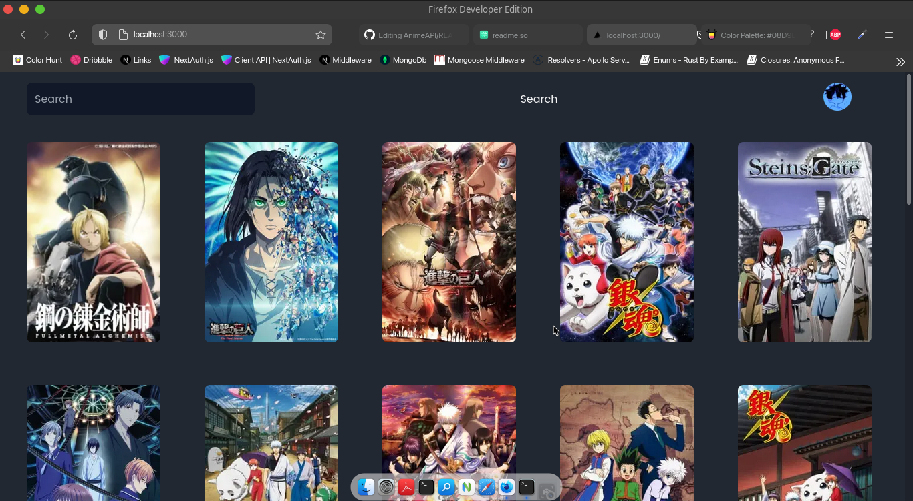
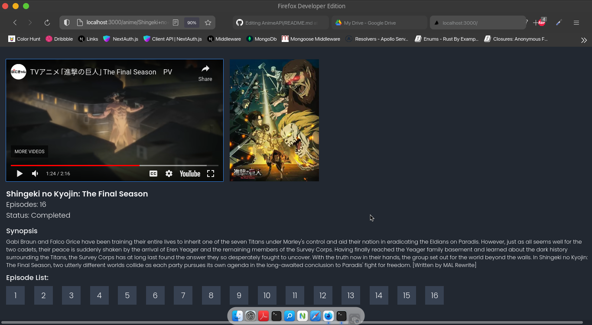

# AnimeAPI

Simple Anime API built upon modern web technologies


## Documentation

[Documentation](https://ihaventmadeanydocsyetlol)


## Authors

- [@ishanPy](https://www.github.com/ishanPy)

## Color Reference

| Color             | Hex                                                                |
| ----------------- | ------------------------------------------------------------------ |
| Blue |  #08D9D6 |
| Black |  #252A34 |
| Crimson |  #FF2E63 |


## Run Locally

Clone the project

```bash
  git clone https://ishanPy/AnimeAPI
```

Go to the project directory

```bash
  cd app
```

Install dependencies

```bash
  npm install OR yarn add
```

Start the server

```bash
  npm run dev OR yarn dev
```


## Screenshots




## Used By

This project is used by the following people:

- me
- also me 

## Optimizations

- Added sharp for Image Optimizations
- Added ```react-svginline``` for SVG Optimizations

## Support

For support, email ishannagar84@gmail.com or join our Slack channel.


## License

[MIT](https://choosealicense.com/licenses/mit/)


## API Reference

#### Application HomePage

```http
  GET /
```

#### Get anime

```http
  GET /api/anime/${id}
```

| Parameter | Type     | Description                       |
| :-------- | :------- | :-------------------------------- |
| `id`      | `string` | **Required**. Id of item to fetch |


#### Application Search Page

```http
  GET /search&q=...
```
